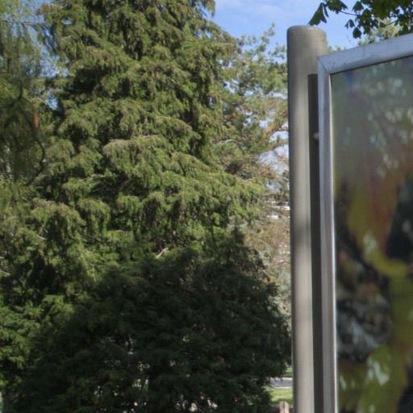
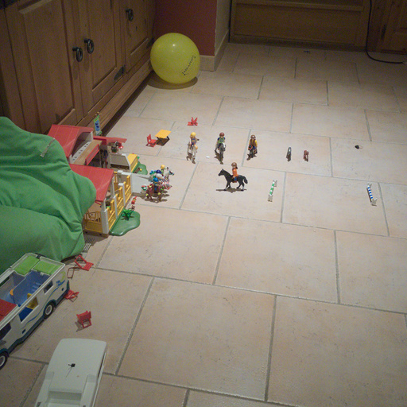

# Implementation and Comparison of different Steganographic techniques
* Eduardo de Sousa Siqueira		nUSP: 9278299
* Igor Barbosa Grécia Lúcio		nUSP: 9778821
---

## Main Objective

In this project we will implement different steganographic techniques to hide data in digital images. We will compare and contrast techniques in the spatial and frequency domains in regard to distortion in relation to the original (cover) image and each other. Our goal will be to learn about the application of Image Steganography as well as its effects.

### Steganography Techniques
1. Least Significant Bit
2. Edge-based Data Embedding
3. Texture Based Encoding
4. Discrete Cosine Transform

## Intended steps to reach objective
We will implement a function corresponding to each technique listed above, together with a function to apply random noise to an image. Then, we will construct a list of all the cover images (found in the [cover images](cover_images/) directory) and apply all the functions to embed different types of data (found in the [testdata](testdata/) directory). We will measure distortion using the *MSE* of the stego image and cover image, and the Peak Signal to Noise Ratio, or *PSNR*. The end result will be a table-like object denoting these measures, as well as some visual examples (printing every image would not be useful)

## Initial Results
Initial code with first results can be found in the (initial.py)[initial.py] python script.

## Input Images
Any images would work in this application. For this project, we will sample cover images from the [ALASKA2 Image Steganalysis](https://www.kaggle.com/c/alaska2-image-steganalysis/data) Kaggle challenge to embed with data of different sizes and types. It was chosen for the ease of access for simple .jpg cover images, and for the similarity of the Kaggle challenge with this project.

Here are some cover image examples we will use:

